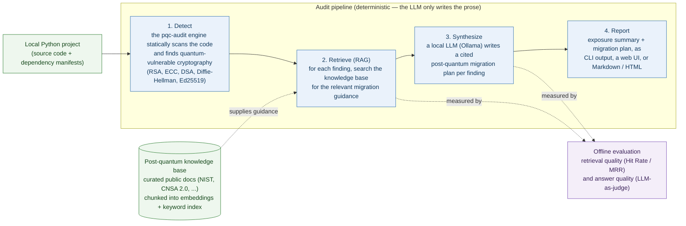

# PQC Audit RAG — post-quantum migration assistant

A retrieval-augmented **agent that turns a cryptography inventory into an
actionable post-quantum (PQC) migration plan**. It scans a Python project for
quantum-vulnerable cryptography (RSA, ECC, DSA, Diffie-Hellman, Ed25519), then,
for each exposure, retrieves guidance from a curated knowledge base (NIST
standards, migration mappings, regulatory timelines) and an LLM synthesizes a
cited, per-finding migration recommendation.

Built for the **LLM Zoomcamp** final project. Runs on a **100% free, local
stack** — no paid API keys required:

- **Detection:** [`pqc-audit`](https://pypi.org/project/pqc-audit/) (OSS engine).
- **LLM:** [Ollama](https://ollama.com) (local, free).
- **Embeddings:** `sentence-transformers` (local), with a dependency-free hashing
  fallback so the package and tests run offline.
- **Vector store:** LanceDB (on-disk) / in-memory.

## The problem

Regulators (US CNSA 2.0 / OMB, EU BSI/ANSSI) are pushing a migration to
post-quantum cryptography with deadlines through 2030–2035. The bottleneck is
visibility and *knowing what to do next*: "you can't migrate what you can't
see", and once you see it you still need per-primitive migration guidance. This
app closes that loop — inventory → retrieved guidance → concrete migration plan.

## Status

Early build. **Phase 0–1 done:** repo scaffold + RAG core (scan → group
exposures → retrieve → synthesize → report) with a testable synthesizer seam and
a seeded public corpus. See the roadmap below.

## Architecture



The **detection is not reimplemented** — this app consumes `pqc-audit` as a
library. This layer adds the migration knowledge (RAG), orchestration and report.
Dependencies point inward (interfaces → RAG → knowledge base / engine); the LLM
only synthesizes prose, the control flow is deterministic code.

## Quickstart

```bash
uv venv --python 3.12 && source .venv/bin/activate
uv pip install -e ".[dev,local-embed,vector,llm]"

# 1. Build the vector index from the curated corpus
python -m pqc_audit_rag.knowledge_base.ingest

# 2. Pull a local model (once) and run an audit
ollama pull llama3.1
pqc-audit-rag audit ./path/to/project --md

# ...or launch the web UI to try it on a real project
streamlit run app/streamlit_app.py
```

The UI mirrors the pqc-scanner report style (verdict banner, severity chips,
per-exposure cards with cited migration guidance) and collects 👍/👎 feedback.
Use **Offline mode** in the sidebar to try it without a running LLM.

Run the tests (no Ollama / no torch needed — uses the offline fallbacks):

```bash
uv pip install -e ".[dev]"
pytest -q
```

## Retrieval evaluation

Four retrieval strategies are evaluated against a ground-truth question set
(`evaluation/ground_truth.json`) with **Hit Rate** and **MRR**; the best is wired
as the default. Reproduce with `python evaluation/evaluate_retrieval.py` (writes
`evaluation/RESULTS.md`). Latest run (**269 LLM-generated questions** over a
45-chunk corpus, k=4, ONNX embeddings):

| Method | Hit Rate | MRR |
|---|---|---|
| dense (vector) | 0.822 | 0.686 |
| text (minsearch) | 0.758 | 0.595 |
| hybrid (RRF) | 0.840 | 0.679 |
| **hybrid + rerank — best (MRR)** | 0.870 | **0.704** |
| rewrite + rerank | **0.877** | 0.695 |

The ground truth is generated with the LLM (`evaluation/generate_ground_truth.py`,
~6 questions/chunk), the course-aligned approach. **MRR** is the primary metric
(ranking quality). The full pipeline — hybrid search (Reciprocal Rank Fusion of
dense + keyword) **plus** re-ranking — wins on MRR, and the re-ranker clearly
helps (0.704 > 0.679). **Query rewriting** (acronym expansion) was also evaluated:
it gives the best Hit Rate (0.877) but slightly lower MRR, so `rerank` stays the
default. All three best practices (hybrid, re-ranking, query rewriting) live in
`search.py`; `PQC_RAG_RETRIEVAL` / the UI selector switch strategy.

## LLM evaluation

Three synthesis prompt styles (concise / detailed / checklist) are compared with an
**LLM-as-judge** (`evaluation/evaluate_llm.py`, writes `LLM_RESULTS.md`): the judge
scores each recommendation for **faithfulness** (grounded in the retrieved context)
and **actionability** (concrete, correct steps), 1–5, over the sample's 6 exposures.
Latest run (judge & synthesizer = llama3.1):

| Prompt style | Faithfulness | Actionability | Overall |
|---|---|---|---|
| **concise — best** | 5.00 | 4.17 | **4.58** |
| detailed | 4.83 | 4.17 | 4.50 |
| checklist | 4.83 | 4.17 | 4.50 |

Margins are small (all three are solid); `concise` edges ahead on faithfulness and
is the default (`PQC_RAG_PROMPT`).

## Evaluation criteria map (LLM Zoomcamp)

This section is filled in as each phase lands, so reviewers can find the
relevant code quickly.

| Criterion | Where | Status |
|---|---|---|
| Problem description | this README | ✅ |
| Retrieval flow (KB + LLM) | `retrieval.py`, `synthesis.py`, `pipeline.py` | ✅ |
| Retrieval evaluation | `evaluation/evaluate_retrieval.py`, `RESULTS.md` (4 methods) | ✅ |
| LLM evaluation | `evaluation/evaluate_llm.py`, `LLM_RESULTS.md` (3 prompts, judge) | ✅ |
| Interface | `app/streamlit_app.py` (Streamlit UI) | ✅ |
| Ingestion pipeline | `knowledge_base/ingest.py` (LanceDB) + `ingestion/dlt_pipeline.py` (dlt→DuckDB) | ✅ (automated) |
| Monitoring | user feedback in `feedback.py`; Postgres + Grafana next | 🟡 feedback done |
| Containerization | `docker-compose.yml` | ⏳ |
| Reproducibility | this README, pinned deps | ⏳ |
| Best practices: hybrid search + re-ranking | `search.py`, `evaluation/RESULTS.md` | ✅ |
| Best practices: query rewriting | `search.py` (heuristic + LLM), `RESULTS.md` | ✅ |
| Cloud deployment (bonus) | `deploy/` | ⏳ |

## Roadmap

0. ✅ Repo scaffold + packaging.
1. ✅ RAG core (scan → group → retrieve → synthesize → report) + public corpus.
2. ✅ Automated ingestion pipeline (chunking + embeddings + persistent LanceDB;
   plus a dlt→DuckDB pipeline, course-aligned).
3. ✅ Retrieval evaluation (dense vs text vs hybrid/RRF vs re-ranking; Hit
   Rate/MRR over a 45-chunk corpus, 269 LLM-generated questions). Winner
   (hybrid + rerank) is the default.
4. ✅ LLM evaluation (3 prompt styles compared with an LLM-as-judge) + query
   rewriting best practice.
5. ✅ Streamlit UI + user feedback.
6. ⏳ Monitoring (Postgres + Grafana, ≥5 charts).
7. ⏳ Containerization (docker-compose) + reproducibility polish.
8. ⏳ Cloud deployment (bonus).

## License

MIT. Built on the MIT-licensed `pqc-audit` engine.
